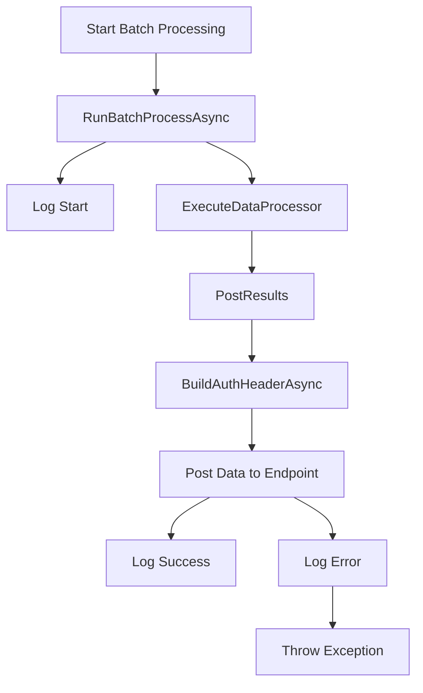
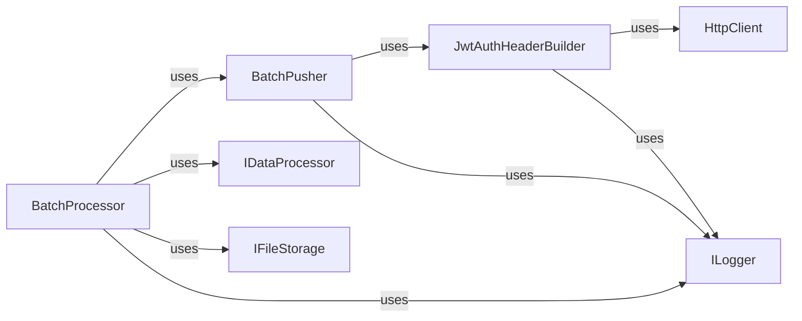
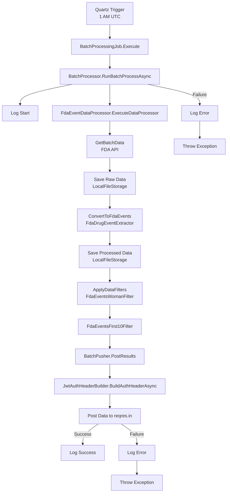
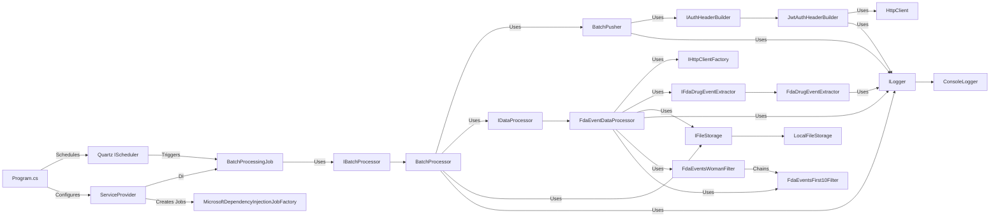

# Collectors Project

## Overview

The Collectors project processes FDA drug event data nightly, filters it (women-only, first 10 records), stores results, and posts to a mock endpoint, built for a .NET interview assignment.

## Components

- **BatchProcessor**: Orchestrates the batch processing workflow.
- **BatchPusher**: Posts processed data to an endpoint with authentication.
- **JwtAuthHeaderBuilder**: Builds JWT headers (in `Core`).
- **FdaEventDataProcessor**: Fetches and processes FDA data.
- **FdaDrugEventExtractor**: Converts raw data to `FdaEvents`.
- **FdaEventsWomanFilter/First10Filter**: Filters `FdaEvents`.
- **LocalFileStorage**: Stores raw, processed, and final data.
- **ConsoleLogger**: Logs execution details.


## Setup

1. Clone the repository:
    ```sh
    git clone https://github.com/your-repo/collectors.git
    cd collectors
    ```

2. Install dependencies:
    ```sh
    dotnet restore
    ```

3. Build the project:
    ```sh
    dotnet build
    ```

4. Run the tests:
    ```sh
    dotnet test
    ```

## Usage

To run the batch processing, use the following command:
```sh
dotnet run --project Collectors
```

## Batch Processor Process Flow

The diagram below illustrates the flow of the batch processing system, from initiation to completion or error handling:



## Batch Processor Coupling Diagram


## Lucina Demo Process Flow 


## Lucina Demo Coupling Diagram

