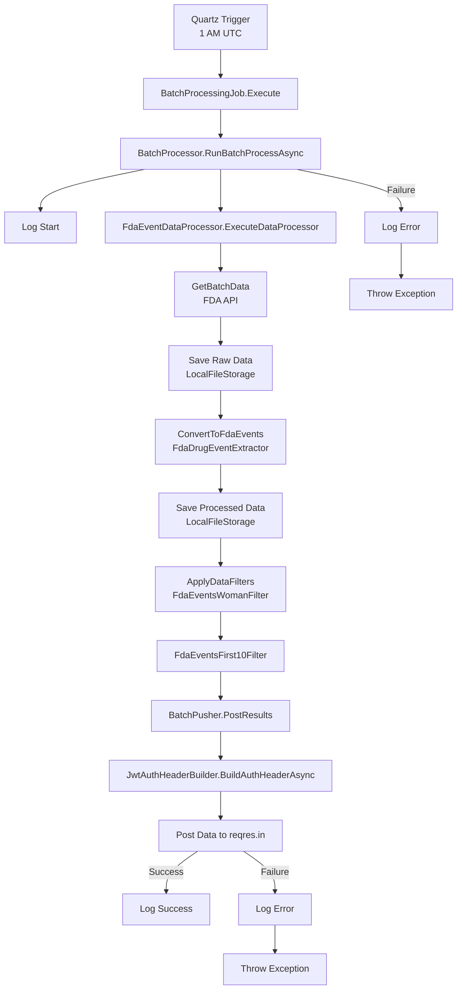
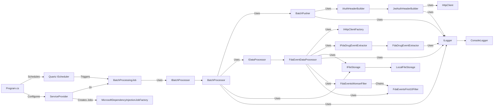

# Core Project

## Overview

The Core project provides essential components and interfaces for logging, authentication, and other core
functionalities.

## Components

- **ILogger**: Interface for logging.
- **JwtAuthHeaderBuilder**: Builds JWT authentication headers for HTTP requests.

## Setup

1. Clone the repository:
    ```sh
    git clone https://github.com/hebertdl/Lucina_Demo.git
    cd Lucina_Demo/Core
    ```

2. Install dependencies:
    ```sh
    dotnet restore
    ```

3. Build the project:
    ```sh
    dotnet build
    ```

4. Run the tests:
    ```sh
    dotnet test
    ```

## Usage

To use the `JwtAuthHeaderBuilder`, create an instance and call the `BuildAuthHeaderAsync` method:

var httpClient = new HttpClient();
var logger = new ConsoleLogger(); // Assuming ConsoleLogger implements ILogger
var authHeaderBuilder = new JwtAuthHeaderBuilder(httpClient, logger, "clientId", "
clientSecret", "https://example.com/token");
var authHeader = await authHeaderBuilder.BuildAuthHeaderAsync();

## Lucina Demo Process Flow



## Lucina Demo Coupling Diagram



