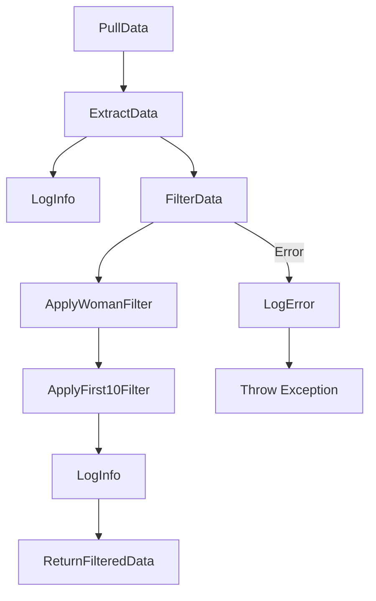
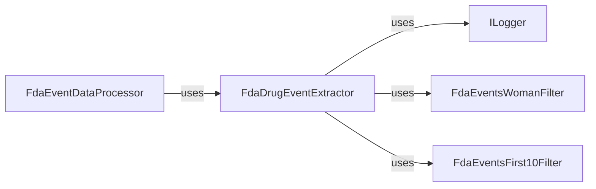

# FdaDrugEvent Project

## Overview

The FdaDrugEvent project is responsible for extracting and processing FDA drug event data. It includes components for
data extraction, filtering, and logging.

## Components

- **FdaDrugEventExtractor**: Extracts FDA drug event data.
- **FdaEventsWomanFilter**: Filters FDA events related to women.
- **FdaEventsFirst10Filter**: Filters the first 10 FDA events.
- **ILogger**: Interface for logging.

## Setup

1. Clone the repository:
    ```sh
    git clone https://github.com/hebertdl/Lucina_Demo.git
    cd Lucina_Demo/FdaDrugEvent
    ```

2. Install dependencies:
    ```sh
    dotnet restore
    ```

3. Build the project:
    ```sh
    dotnet build
    ```

4. Run the tests:
    ```sh
    dotnet test
    ```

## Usage

To use the `FdaDrugEventExtractor`, create an instance and call the `ExtractData` method:

```csharp
var extractor = new FdaDrugEventExtractor();
var data = extractor.ExtractData();
```

## Process Flow



## Coupling


